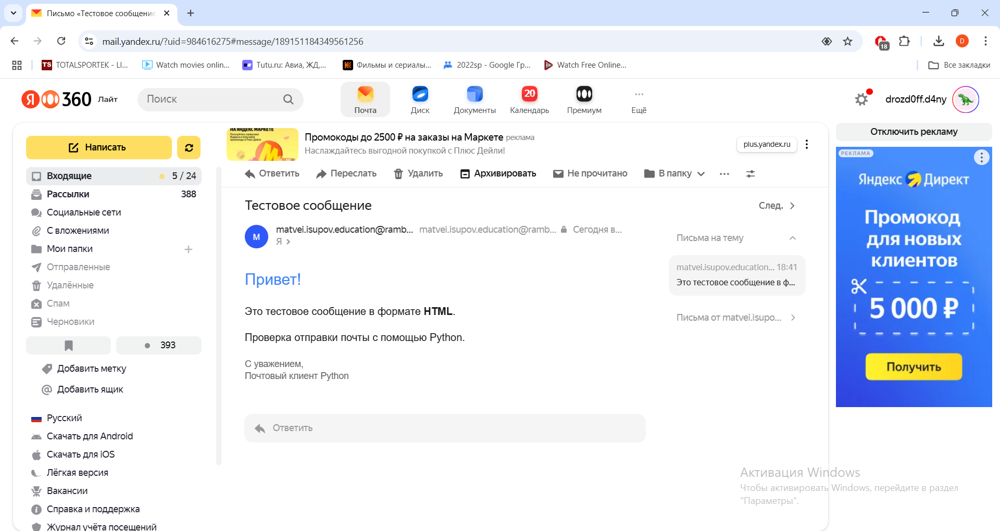

# Практика 5. Прикладной уровень

## Программирование сокетов.

### A. Почта и SMTP (7 баллов)

### 1. Почтовый клиент (2 балла)
Напишите программу для отправки электронной почты получателю, адрес
которого задается параметром. Адрес отправителя может быть постоянным. Программа
должна поддерживать два формата сообщений: **txt** и **html**. Используйте готовые
библиотеки для работы с почтой, т.е. в этом задании **не** предполагается общение с smtp
сервером через сокеты напрямую.

Приложите скриншоты полученных сообщений (для обоих форматов).

#### Демонстрация работы
Не захотел подключаться к моему рамблеру, поэтому позаимствовал почту друга:

### 2. SMTP-клиент (3 балла)
Разработайте простой почтовый клиент, который отправляет текстовые сообщения
электронной почты произвольному получателю. Программа должна соединиться с
почтовым сервером, используя протокол SMTP, и передать ему сообщение.
Не используйте встроенные методы для отправки почты, которые есть в большинстве
современных платформ. Вместо этого реализуйте свое решение на сокетах с передачей
сообщений почтовому серверу.

Сделайте скриншоты полученных сообщений.

#### Демонстрация работы

### 3. SMTP-клиент: бинарные данные (2 балла)
Модифицируйте ваш SMTP-клиент из предыдущего задания так, чтобы теперь он мог
отправлять письма с изображениями (бинарными данными).

Сделайте скриншот, подтверждающий получение почтового сообщения с картинкой.

#### Демонстрация работы

---

_Многие почтовые серверы используют ssl, что может вызвать трудности при работе с ними из
ваших приложений. Можете использовать для тестов smtp сервер СПбГУ: mail.spbu.ru, 25_

### Б. Удаленный запуск команд (3 балла)
Напишите программу для запуска команд (или приложений) на удаленном хосте с помощью TCP сокетов.

Например, вы можете с клиента дать команду серверу запустить приложение Калькулятор или
Paint (на стороне сервера). Или запустить консольное приложение/утилиту с указанными
параметрами. Однако запущенное приложение **должно** выводить какую-либо информацию на
консоль или передавать свой статус после запуска, который должен быть отправлен обратно
клиенту. Продемонстрируйте работу вашей программы, приложив скриншот.

Например, удаленно запускается команда `ping yandex.ru`. Результат этой команды (запущенной на
сервере) отправляется обратно клиенту.

#### Демонстрация работы
Кодировка полетела, но всё остальное работает:

### В. Широковещательная рассылка через UDP (2 балла)
Реализуйте сервер (веб-службу) и клиента с использованием интерфейса Socket API, которая:
- работает по протоколу UDP
- каждую секунду рассылает широковещательно всем клиентам свое текущее время
- клиент службы выводит на консоль сообщаемое ему время

#### Демонстрация работы

## Задачи

### Задача 1 (2 балла)
Рассмотрим короткую, $10$-метровую линию связи, по которой отправитель может передавать
данные со скоростью $150$ бит/с в обоих направлениях. Предположим, что пакеты, содержащие
данные, имеют размер $100000$ бит, а пакеты, содержащие только управляющую информацию
(например, флаг подтверждения или информацию рукопожатия) – $200$ бит. Предположим, что у
нас $10$ параллельных соединений, и каждому предоставлено $1/10$ полосы пропускания канала
связи. Также допустим, что используется протокол HTTP, и предположим, что каждый
загруженный объект имеет размер $100$ Кбит, и что исходный объект содержит $10$ ссылок на другие
объекты того же отправителя. Будем считать, что скорость распространения сигнала равна
скорости света ($300 \cdot 10^6$ м/с).
1. Вычислите общее время, необходимое для получения всех объектов при параллельных
непостоянных HTTP-соединениях
2. Вычислите общее время для постоянных HTTP-соединений. Ожидается ли существенное
преимущество по сравнению со случаем непостоянного соединения?

#### Решение
1. По одному соединению скорость передачи будет $150/10=15$ бит/с. Пусть у нас $2$ управляющих передачи (SYN и SYN-ACK) на TCP-рукопожатие и еще $1$ на HTTP-запрос, тогда 
время на передачу одного управляющего пакета $200/15 = 13\frac{1}{3}$ с, значит на все управляющие пакеты время передачи 
$13\frac{1}{3}*3=40$ с. Время на передачу объекта $100000/15=6666\frac{2}{3}$ с. Значит, на передачу одного объекта тратится 
$6666\frac{2}{3} + 40 = 6706\frac{2}{3}$ с. После получения первичного объекта, открываются параллельные соединения для передачи 
еще $10$ объектов, таким образом, итоговое время передачи всего будет $6706\frac{2}{3} + 6706\frac{2}{3} = 13413\frac{1}{3}$ с.
2. Здесь у нас используется один TCP-сокет, который затем используется для передачи всех объектов. Ему доступен весь канал $150$ бит/с. 
Время на передачу одного управляющего пакета $200/150=1\frac{1}{3}$ с. Тогда на TCP потратится $1\frac{1}{3}*2=2\frac{2}{3}$ с. 
На каждый HTTP-запрос будет тратиться $1\frac{1}{3}$ с. Передача одного объекта занимает $100000/150=666\frac{2}{3}$ с. Тогда 
суммарно на каждый объект тратится $666\frac{2}{3}+1\frac{1}{3}=668$ с. После получения первого объекта мы последовательно получаем еще 
$10$ таких же объектов, тогда итоговое время передачи будет $668 * 10 + 668 + 2\frac{2}{3}=7350\frac{2}{3}$ с. \
В данном случае получилось существенное преимущество при постоянном соединении. В общем случае также ожидается преимущество за счёт 
уменьшения накладных расходов при отсутствии необходимости повторного установления соединения.

### Задача 2 (3 балла)
Рассмотрим раздачу файла размером $F = 15$ Гбит $N$ пирам. Сервер имеет скорость отдачи $u_s = 30$
Мбит/с, а каждый узел имеет скорость загрузки $d_i = 2$ Мбит/с и скорость отдачи $u$. Для $N = 10$, $100$
и $1000$ и для $u = 300$ Кбит/с, $700$ Кбит/с и $2$ Мбит/с подготовьте график минимального времени
раздачи для всех сочетаний $N$ и $u$ для вариантов клиент-серверной и одноранговой раздачи.

#### Решение

### Задача 3 (3 балла)
Рассмотрим клиент-серверную раздачу файла размером $F$ бит $N$ пирам, при которой сервер
способен отдавать одновременно данные множеству пиров – каждому с различной скоростью,
но общая скорость отдачи при этом не превышает значения $u_s$. Схема раздачи непрерывная.
1. Предположим, что $\dfrac{u_s}{N} \le d_{min}$.
   При какой схеме общее время раздачи будет составлять $\dfrac{N F}{u_s}$?
2. Предположим, что $\dfrac{u_s}{N} \ge d_{min}$. 
   При какой схеме общее время раздачи будет составлять  $\dfrac{F}{d_{min}}$?
3. Докажите, что минимальное время раздачи описывается формулой $\max\left(\dfrac{N F}{u_s}, \dfrac{F}{d_{min}}\right)$?

#### Решение
1. Если сервер равномерно распределяет свою мощность между всеми пирами. Тогда каждому выделяется скорость $\dfrac{u_s}{N}$. 
Тогда, при условии $\dfrac{u_s}{N} \le d_{min}$, общее время раздачи составит $\dfrac{F}{\dfrac{u_s}{N}} = \dfrac{N F}{u_s}$.
ч.т.д.
2. Выделяем самому медленному пиру скорость $d_{min}$, остальным распределим равномерно остаток. Тогда на каждого из остальных пиров 
скорость будет $\min\left(d_i, \dfrac{u_s-d_{min}}{N-1}\right)$, $d_i \ge d_{min}$, $\dfrac{u_s-d_{min}}{N-1} \ge \dfrac{u_s-\dfrac{u_s}{N}}{N-1} = 
\dfrac{u_s}{N} \ge d_{min}$, тогда $\min\left(d_i, \dfrac{u_s-d_{min}}{N-1}\right) \ge d_{min}$. В таком случае общее время раздачи будет 
составлять $\dfrac{F}{d_{min}}$. ч.т.д.
3. Сервер всего должен передать $N F$ бит. Он не может передать эти данные быстрее, чем за $\dfrac{N F}{u_s}$. Самому медленному 
пиру нужно получить $F$ бит. Он не сможет это сделать быстрее, чем за $\dfrac{F}{d_{min}}$. Тогда $T \ge \max\left(\dfrac{N F}{u_s}, \dfrac{F}{d_{min}}\right)$. 
Достижимость каждой из нижних границ была показана в предыдущих двух пунктах. ч.т.д.
